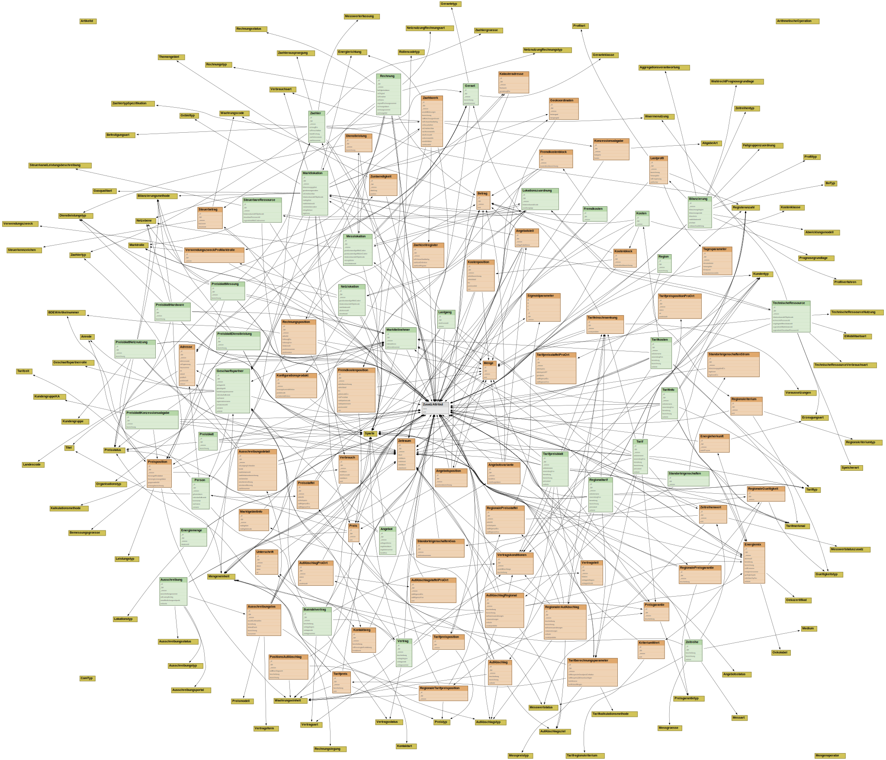
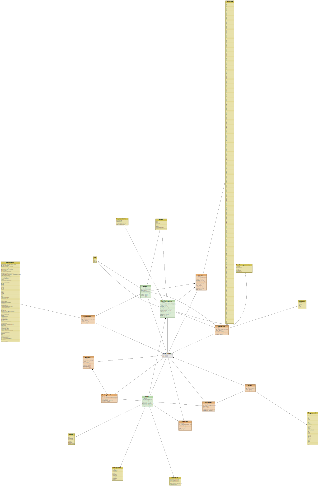
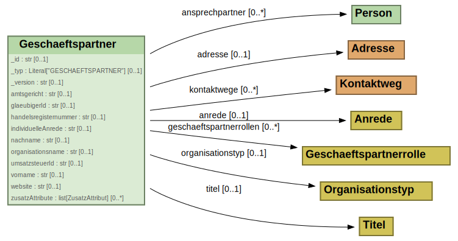

# BO4E-CLI

A command-line tool for developers who work with [BO4E](https://www.bo4e.de/) models.
It builds on the [BO4E-Schemas](https://github.com/bo4e/BO4E-Schemas) repository as
single source of truth and helps you fetch, customise, compare and generate code from
those schemas. It ships as a small self-contained binary with no runtime dependencies.

## Features

- **Pull** JSON schemas of a specific version (or `latest`) from GitHub and replace the
  online `$ref`s with relative paths so the schemas work offline.
- **Edit** schemas via a static JSON config file — add fields, add models, add enum
  values, mark fields as non-nullable — to tailor the BO4E models to your use case.
- **Generate** code from the (edited) schemas. Currently supports
  `python-pydantic`, `python-sql-model`, `rust-plain`, and `rust-crate`
  outputs; further generators can be added.
- **Diff** two schema directories and emit a machine-readable JSON diff.
- **Compatibility matrix** across a chain of diff files for quick visual review.
- **Classify** a version bump as technical / functional / major based on the diff.
- **Repo versions** — list version tags of the BO4E-python repository. Mostly used
  by CI.
- **Graph** the BO4E type-reference graph — emit a machine-readable GraphIR (JSON
  or GraphML), a big-picture diagram (DOT / PlantUML) with Louvain / component /
  package clustering, or per-class diagrams.

## Install

Pre-built binaries are published for **macOS**, **Linux** and **Windows** on every tag
of the [Releases page](https://github.com/bo4e/BO4E-CLI/releases/latest). Pick whichever
channel is most convenient:

### Linux / macOS — shell installer

```bash
curl --proto '=https' --tlsv1.2 -LsSf https://github.com/bo4e/BO4E-CLI/releases/latest/download/bo4e-cli-installer.sh | sh
```

The script installs the binary under `~/.local/bin` (or `$CARGO_HOME/bin` if set) and
records an uninstall hook beside it.

### Windows — PowerShell installer

```powershell
irm https://github.com/bo4e/BO4E-CLI/releases/latest/download/bo4e-cli-installer.ps1 | iex
```

### Windows — MSI installer

Download the latest `bo4e-cli-x86_64-pc-windows-msvc.msi` from the
[Releases page](https://github.com/bo4e/BO4E-CLI/releases/latest) and double-click it.
The CLI then appears under *Apps & Features*.

### Manual download

Each release also ships raw tarballs (`.tar.xz` / `.zip`) for every supported target —
useful if you want to drop the binary somewhere yourself.

### From source

```bash
# compile from source:
cargo install bo4e-cli
# or fetch a pre-built binary without compiling:
cargo binstall bo4e-cli
```

Verify the install:

```bash
bo4e --version
bo4e --help
```

> Homebrew tap and Scoop bucket distribution may be added later; until then please use
> one of the channels above.

### Slim install with only the generators you need

When installing from source you can pick a single generator instead of all of them:

```
cargo install bo4e-cli --no-default-features --features python-pydantic
cargo install bo4e-cli --no-default-features --features python-sql-model
cargo install bo4e-cli --no-default-features --features rust-plain
cargo install bo4e-cli --no-default-features --features rust-crate
```

Available selectors: `python-pydantic`, `python-sql-model`, `rust-plain`,
`rust-crate`, plus the umbrellas `python` (both Python flavours) and
`rust` (both Rust flavours).

## Uninstall

The binary is removable in one step from every channel it shipped with:

| Installed via                 | Uninstall                                                                                                       |
|-------------------------------|-----------------------------------------------------------------------------------------------------------------|
| Linux / macOS shell installer | run the `uninstall` script that the installer placed next to the binary, or simply `rm $(which bo4e)`           |
| Windows PowerShell installer  | re-run the installer URL with `-Uninstall`, or delete `bo4e.exe` from the install prefix shown by the installer |
| Windows MSI                   | *Apps & Features* → *bo4e-cli* → *Uninstall*                                                                    |
| Manual download               | delete the binary you copied out of the tarball                                                                 |
| `cargo install` / `binstall`  | `cargo uninstall bo4e-cli`                                                                                      |

## Commands

In the following I will describe some details on how to use the functionality provided by this CLI. Please keep in
mind that I won't explain every command line option. In this regard, please refer to the help text of the CLI.
If you are missing something in the following explanation and/or the help text, feel free
to [create an issue](https://github.com/bo4e/BO4E-CLI/issues/new).

> Note: The CLI has 3 output modes: normal, quiet and verbose. The normal mode is the default one and should be
> sufficient for most use cases. The quiet mode is useful if you want to use the CLI in a script and just want to
> check the exit code. The verbose mode is useful if you want to see more detailed information about the execution
> of the CLI. You can switch between these modes using the `--quiet` and `--verbose` flags. If you want to see the
> help text of a specific command, you can use the `--help` flag after the command. For example, `bo4e pull --help`
> will show you the help text for the `pull` command.

## `bo4e pull`

Pull all BO4E-JSON-schemas of a specific version (or `latest`).

Beside the json-files a `.version` file will be created in utf-8 format at root of the output directory.
This file is needed for other commands of this CLI.

The schemas pulled from the repository `BO4E-Schemas` contain online references to each other
(e.g. `"$ref": "https://raw.githubusercontent.com/BO4E/BO4E-Schemas/v202401.0.1/src/bo4e_schemas/bo/Angebot.json#"`).
This is not very convenient if you want to work with the schemas offline. And if you need to edit the schemas using
the config file, this would be a problem.

Per default (can be changed through command line option) the command replaces all online references
with relative references.

> Note: You might encounter rate limiting issues against the GitHub API. If true, please make use of a PAT. You can
> either provide it through the option `--token` or by setting the environment variable `GITHUB_ACCESS_TOKEN`
> or by having the GitHub CLI installed while being logged in. If a token wasn't provided either through the first or
> the second method, the CLI will automatically check for the GitHub CLI and if there is a user logged in.
> If true, the CLI will receive a temporary token by executing `gh auth token`.
>
> Also note that you don't need any special permissions behind this PAT. The GitHub API will increase the rate limit
> if the provided PAT is valid. If you are more interested in this, please refer to the
> [GitHub documentation](https://docs.github.com/en/rest/using-the-rest-api/rate-limits-for-the-rest-api?apiVersion=2022-11-28)

Examples:

```bash
bo4e pull -o ./bo4e_schemas_latest                  # latest release
bo4e pull -o ./bo4e_schemas_v202501 -t v202501.0.0  # a specific tag
```

Other `pull` flags: `--no-update-refs` (keep online `$ref` URLs as-is) and
`--no-clear-output` (skip wiping the output dir).

## `bo4e edit`

In short, this lets you edit the schemas using a static config-file. Ideally, no one should need it but in
reality you might not have enough time to wait for the gremium or just want to experiment and elaborate
an appropriate model. Here is a list of what it can do:

- Define non-nullable properties (in most cases changes it to a required field)
- Add additional properties
- Add additional models
- Add additional enum values

### Config file

I think it's most effective to learn by example here:

```json
{
  "nonNullableFields": [
    "bo\\.Angebot\\.angebotspreis",
    "(bo|com)\\.\\w+\\._typ",
    "\\w+\\.\\w+\\._id"
  ],
  "additionalFields": [
    {
      "pattern": "bo\\.Angebot",
      "fieldName": "foo",
      "fieldDef": {
        "type": "number"
      }
    },
    {
      "$ref": "./models/bo/Geschaeftspartner_extension.json"
    }
  ],
  "additionalEnumItems": [
    {
      "pattern": "enum\\.BoTyp",
      "items": [
        "Bilanzierung",
        "Dokument"
      ]
    }
  ],
  "additionalModels": [
    {
      "module": "bo",
      "schema": {
        "$ref": "models/bo/Bilanzierung.json"
      }
    },
    {
      "module": "bo",
      "schema": {
        "additionalProperties": true,
        "title": "Dokument",
        "type": "object",
        "description": "A generic document reference like for bills, order confirmations and cancellations",
        "properties": {
          "boTyp": {
            "allOf": [
              {
                "$ref": "../enum/BoTyp.json#"
              }
            ],
            "title": "BoTyp",
            "default": "Dokument"
          },
          "erstellungsdatum": {
            "format": "date-time",
            "title": "Erstellungsdatum",
            "type": "string"
          }
        },
        "required": [
          "erstellungsdatum"
        ]
      }
    }
  ]
}
```

The config file can contain the following keys:

- `nonNullableFields`: A list of regex patterns which will be used to define non-nullable fields.
  The field will be required if the default value was `null`, which will be mostly the case.
  The regex pattern will be (full-)matched to the path of each field.
  An example of such a path would be `bo.Angebot.angebotspreis`. If the pattern matches, the field will be non-nullable.
- `additionalFields`: A list of additional fields which will be added to the schema.
    - `pattern`: A regex pattern which will be used to match the path of the schema (e.g. `bo.Angebot`).
      The field will be added to each schema to which the pattern matches.
    - `fieldName`: The name of the field which will be added.
    - `fieldDef`: The definition of the field which will be added.
- `additionalEnumItems`: A list of additional enum items which will be added to the schema.
    - `pattern`: A regex pattern which will be used to match the path of the enum (e.g. `enum.BoTyp`).
      The items will be added to each enum to which the pattern matches.
    - `items`: A list of items which will be added to the enum.
- `additionalModels`: A list of additional models which will be added to the schema.
    - `module`: The module to which the schema will be added.
    - `schema`: The schema definition which will be added.

Note: For all config keys (except for `nonNullableFields`), you can alternatively use the `"$ref"` key
to reference to a file.
This is useful to keep the config file small and to reuse definitions.
If the path is relative it will be applied to the path of the directory where the config file is stored in.
But, you can define absolute paths if you want.

As a little extra feature for `additionalFields`: If you want to define multiple fields in one external file,
you can define a list of fields instead of a single field. The reference in the `"$ref"` key is the same.

Example of `./models/bo/Geschaeftspartner_extension.json`:

```json
[
  {
    "pattern": "bo\\.Geschaeftspartner",
    "field_name": "foo",
    "field_def": {
      "type": "number"
    }
  },
  {
    "pattern": "bo\\.Geschaeftspartner",
    "field_name": "bar",
    "field_def": {
      "type": "string"
    }
  }
]
```

### Default `_version` stamping

All BO4E-Schemas contain a field `_version` which holds the BO4E version. The schemas
pulled from [BO4E-Schemas](https://github.com/bo4e/BO4E-Schemas) carry that as a
default; for additional models you define yourself this would otherwise be tedious to
keep in sync across version upgrades.

`bo4e edit` therefore **rewrites the `_version` default on every schema to match the
`.version` file**. Pass `--no-default-version` to opt out.

### Dirty-workdir suffix on the output version

Edited output is "downstream" of the upstream BO4E release, so `bo4e edit` also brands
the output version with today's date as a `.d<YYYYMMDD>` suffix (e.g.
`v202501.0.0.d20260511`). This is on by default so the edited schemas are visibly
distinguishable from the unmodified release; pass `--no-dirty-version` to disable.

Example:

```bash
bo4e edit -i ./bo4e_schemas_latest -o ./bo4e_schemas_edited -c ./my_config_file.json
```

Other `edit` flags: `--no-clear-output` (skip wiping the output dir before writing).

## `bo4e generate`

Generate code from BO4E JSON schemas. The output flavour is selected as a positional subcommand.

```
bo4e generate -i <input-dir> -o <output-dir> [--no-clear-output] [--templates-dir <dir>] <FLAVOUR> [flavour-options]
```

Examples:

```bash
# Python (pydantic-v2 models)
bo4e generate -i ./bo4e_schemas_edited -o ./bo4e_schemas_python python-pydantic

# Python (SQLModel — pydantic + SQLAlchemy ORM)
bo4e generate -i ./bo4e_schemas_edited -o ./bo4e_schemas_sql python-sql-model

# Rust (loose files for embedding into your own crate)
bo4e generate -i ./bo4e_schemas_edited -o ./src/bo4e rust-plain

# Rust (full Cargo crate with custom name)
bo4e generate -i ./bo4e_schemas_edited -o ./bo4e-rust-crate rust-crate --crate-name my-bo4e
```

The `rust-plain` flavour writes only `.rs` source files into the target directory and does **not** generate a `Cargo.toml`. The host crate must declare these dependencies for the generated code to compile (use `rust-crate` if you want them written for you):

```toml
[dependencies]
serde               = { version = "1", features = ["derive"] }
serde_json          = "1"
chrono              = { version = "0.4", features = ["serde"] }
uuid                = { version = "1", features = ["serde", "v4", "macro-diagnostics"] }
rust_decimal        = { version = "1", features = ["serde"] }
rust_decimal_macros = "1"
```

<a name="supported-languages"></a>Arguments:

| Argument            | Short | Description                                                          |
|---------------------|-------|----------------------------------------------------------------------|
| `--input`           | `-i`  | Directory containing input JSON schemas.                             |
| `--output`          | `-o`  | Directory to write generated code to.                                |
| `--no-clear-output` |       | Skip clearing the output directory before writing (default: clear).  |
| `--templates-dir`   |       | Override embedded Jinja templates with a directory.                  |
| `<FLAVOUR>`         |       | One of `python-pydantic`, `python-sql-model`, `rust-plain`, `rust-crate`. |
| `--crate-name`      |       | `rust-crate` only — Cargo package name written into the generated `Cargo.toml` (default: `bo4e`). |

**Breaking change vs. earlier versions:** the `-t <flavour>` flag has been replaced with a positional subcommand. Migrate by removing `-t` and moving the flavour name to the end of the command.

## `bo4e diff schemas`

Compares the JSON-schemas in the two input directories and saves the differences to the output file (JSON).
The output file will also contain information about the compared versions.

<details>
<summary>Here is an example of how this diff-file looks like</summary>

```json
{
  "old_schemas": {
    "schemas": [
      {
        "module": [
          "enum",
          "Kundentyp"
        ],
        "schema": {
          // ...
        }
      }
      // ...
    ],
    "version": {
      "major": 202501,
      "functional": 0,
      "technical": 0,
      "candidate": null,
      "commit_part": null,
      "dirty_workdir_date": null
    }
  },
  "new_schemas": {
    "schemas": [
      {
        "module": [
          "bo",
          "Tarif"
        ],
        "schema": {
          // ...
        }
      }
      // ...
    ],
    "version": {
      "major": 202501,
      "functional": 1,
      "technical": 0,
      "candidate": null,
      "commit_part": null,
      "dirty_workdir_date": null
    }
  },
  "changes": [
    {
      "type": "class_removed",
      "old": "bo\\AdditionalModel.json",
      "new": null,
      "old_trace": "/bo/AdditionalModel#",
      "new_trace": "/#"
    },
    {
      "type": "field_type_changed",
      "old": {
        "description": "Eine generische ID, die für eigene Zwecke genutzt werden kann.\nZ.B. könnten hier UUIDs aus einer Datenbank stehen oder URLs zu einem Backend-System.",
        "title": " Id",
        "default": null,
        "type": "string",
        "format": null
      },
      "new": {
        "description": "Eine generische ID, die für eigene Zwecke genutzt werden kann.\nZ.B. könnten hier UUIDs aus einer Datenbank stehen oder URLs zu einem Backend-System.",
        "title": " Id",
        "default": null,
        "any_of": [
          {
            "description": "",
            "title": "",
            "default": null,
            "type": "string",
            "format": null
          },
          {
            "description": "",
            "title": "",
            "default": null,
            "type": "null"
          }
        ]
      },
      "old_trace": "/com/Konzessionsabgabe#.properties['_id']",
      "new_trace": "/com/Konzessionsabgabe#.properties['_id']"
    }
    // ...
  ]
}
```

</details>

The type of change can be one of the following:

- `field_added`
- `field_removed`
- `field_default_changed`
- `field_description_changed`
- `field_title_changed`
- field type change types:
    - `field_cardinality_changed`
    - `field_reference_changed`
    - `field_string_format_changed`
    - `field_any_of_type_added`
    - `field_any_of_type_removed`
    - `field_all_of_type_added`
    - `field_all_of_type_removed`
    - `field_type_changed`  # An arbitrary unclassified change in type
- `class_added`
- `class_removed`
- `class_description_changed`
- `enum_value_added`
- `enum_value_removed`

Example:

```bash
bo4e diff schemas ./bo4e_schemas_v2024.0.0 ./bo4e_schemas_latest -o diff_v2024.0.0_to_latest.json
```

## `bo4e diff matrix`

This command creates a difference matrix just like
the [compatibility matrix](https://bo4e.github.io/BO4E-python/latest/changelog.html#compatibility) visible in the
documentation.

It uses multiple diff-files created by `bo4e diff schemas` where each file is represented by one column
in the resulting matrix. The diff-files will be ordered internally from earliest to latest version. So the order you
give the files as arguments doesn't matter. To make this work, the versions inside these diff files must be
consecutive and ascending. I.e. you have to be able to create an ascending series of versions where the `new_version`
must match the `old_version` of it's next neighbour. Example of valid input files:

| file 3                | &#8594; | file 1                | &#8594; | file 2                |
|-----------------------|---------|-----------------------|---------|-----------------------|
| v1.0.0 &#8594; v1.0.2 |         | v1.0.2 &#8594; v1.3.0 |         | v1.3.0 &#8594; v2.0.0 |

Example:

```bash
bo4e diff matrix diff_3.json diff_2.json diff_1.json -o matrix.csv -et csv
```

## `bo4e diff version-bump`

Given a diff file this command decides whether the list of changes corresponds to a
functional or just technical change, compares that to the version numbers in the diff
file, and reports whether the version bump is consistent.

**Exit code:** in `--quiet` mode the process exits with `1` on an invalid bump, so it
plugs straight into CI checks. In normal / verbose mode the failure is printed to
stderr but the process still exits `0` — interactive runs and shell pipelines that
don't care about the bump are not poisoned.

In `--verbose` mode the command additionally prints which bump kind it inferred from
the version numbers vs. from the list of changes, and notes when a major bump was
detected but suppressed via `--no-major`.

Example:

```bash
bo4e diff version-bump ./diff.json
bo4e diff version-bump ./diff.json --no-major   # reject major bumps
bo4e --quiet diff version-bump ./diff.json      # CI: exit code only
```

## `bo4e repo versions`

Lists the recent BO4E-python version tags reachable from a git reference, in
descending chronological order. Run it inside a clone of
[bo4e/BO4E-python](https://github.com/bo4e/BO4E-python) (technically any repo with
the same versioning scheme works).

Flags:

| Flag                        | Short | Description                                                                                           |
|-----------------------------|-------|-------------------------------------------------------------------------------------------------------|
| `-n`                        |       | Number of versions to retrieve. `0` (default) returns all versions since `v202401.0.0`.               |
| `--ref`                     | `-r`  | Tag / branch / commit to start from (default: `main`). For a tag the tag itself is excluded.          |
| `--exclude-candidates`      | `-c`  | Skip release candidates.                                                                              |
| `--exclude-technical-bumps` | `-t`  | Collapse technical-only versions to the latest one in each functional/major release.                  |
| `--show-full-commit-sha`    | `-s`  | Show full commit SHA instead of the 6-character prefix.                                               |
| `--no-validate-releases`    |       | Skip checking that each tag has a published GitHub release (faster, fully offline).                   |
| `--token`                   |       | GitHub PAT for the release-validation step (falls back to `$GITHUB_ACCESS_TOKEN` or `gh auth token`). |

Under `--quiet` only the version strings are printed (one per line) — handy for piping
into `bo4e pull` or `bo4e diff`. In normal mode a styled table with commit SHA and
date is rendered.

Example:

```bash
bo4e repo versions -n 5 --exclude-candidates --exclude-technical-bumps
```

## `bo4e graph extract`

Build a machine-readable graph of all class-to-class references in a BO4E schemas
directory. The output is consumed by `bo4e graph overview` / `bo4e graph single`,
or you can export GraphML for external tools such as Gephi or yEd.

| Flag       | Short | Description                                                                |
|------------|-------|----------------------------------------------------------------------------|
| `--input`  | `-i`  | Schemas directory (typically the output of `bo4e pull`).                   |
| `--output` | `-o`  | Output file path.                                                          |
| `--format` |       | `json` (default — internal GraphIR consumed by `overview`/`single`) or `graphml`. |

Example:

```bash
bo4e graph extract -i ./bo4e_schemas_latest -o ./graph.json
```

## `bo4e graph overview`

Render the big-picture diagram for every class in a graph file as Graphviz DOT or
PlantUML source. Nodes are package-coloured HTML tables; clusters can be Louvain
communities (default), weakly-connected components, BO4E packages
(`bo`, `com`, `enum`, …), or off entirely. Filters carve out a subset (glob
includes/excludes or BFS from a named class).

> Note: the default DOT output uses `--layout neato --overlap prism`, which gives
> the cleanest packing but needs a Graphviz build linked against the GTS
> triangulation library. The upstream `yuzutech/kroki` image is **not** — see
> `/setup/KROKI.md` for the GTS overlay used for the renderings below. For a
> fully portable build, pass `--overlap scale`.

Example 1 — full overview with per-class field-name labels (extract once, then
render the DOT via Graphviz or Kroki):

```bash
bo4e graph extract -i ./bo4e_schemas_latest -o ./graph.json
bo4e graph overview -i ./graph.json -o ./overview.dot --detail names
curl --data-binary @overview.dot http://localhost:8000/graphviz/svg > overview.svg
```



Example 2 — subset reachable from a single class (forward BFS), with a tighter
layout because the graph is much smaller. `--reachable-from` matches on the
dotted module path, so pass `bo.Vertrag` rather than just `Vertrag`:

```bash
bo4e graph overview -i ./graph.json -o ./vertrag.dot --detail full \
    --reachable-from bo.Vertrag --node-margin 10
```



Flags:

| Flag                       | Description                                                                                                            |
|----------------------------|------------------------------------------------------------------------------------------------------------------------|
| `--input`, `-i`            | GraphIR JSON file produced by `bo4e graph extract`.                                                                    |
| `--output`, `-o`           | Output DOT / PlantUML source file.                                                                                     |
| `--format`                 | `dot` (default) or `plantuml`.                                                                                         |
| `--detail`                 | `none` / `names` / `full` — how much per-node detail to render. Default `none`.                                        |
| `--clustering`             | `louvain` (default), `components`, `package`, or `none`.                                                               |
| `--seed`                   | RNG seed for `--clustering louvain` (default: randomised each run; set for reproducible layouts).                      |
| `--include` / `--exclude`  | Globs over dotted module paths (e.g. `bo.*`, `*.Angebot`). Repeatable; `exclude` is applied after `include`.           |
| `--reachable-from`         | Restrict to nodes reachable from this class via forward BFS. Requires the dotted module path (e.g. `bo.Vertrag`).      |
| `--layout`                 | Graphviz engine: `neato` (default), `dot`, `fdp`, `sfdp`, `circo`, `twopi`. Ignored for `--format plantuml`.           |
| `--overlap`                | Overlap-removal strategy: `prism` (default; needs GTS), `scale`, `scalexy`, `true`, `false`.                           |
| `--node-margin`            | Extra margin (points) around each node, for non-`dot` layouts. Default `50`; pass `0` to fall back to Graphviz's `+4`. |
| `--edge-labels`            | Re-enable `fieldname [cardinality]` labels on every edge (off by default to reduce clutter).                           |
| `--link-template`          | URL template for clickable class nodes. Supports `{pkg}`, `{module}`, `{class}`, `{version}`, and the `{cwd[.…]}` / `{output_dir[.…]}` path variants. Run `bo4e graph overview --help` for the full reference. |

## `bo4e graph single`

Render a focused diagram for a single class — or, with `--class all`, one diagram
per class in the graph. The output is a file in the first case and a directory
mirroring the BO4E package layout in the second. The focused class is drawn with
its fields; the neighbours within the chosen BFS radius are shown lighter.

Example:

```bash
bo4e graph single -i ./graph.json -o ./geschaeftspartner.dot --class Geschaeftspartner
curl --data-binary @geschaeftspartner.dot http://localhost:8000/graphviz/svg > geschaeftspartner.svg
```



Flags:

| Flag                          | Description                                                                                                                          |
|-------------------------------|--------------------------------------------------------------------------------------------------------------------------------------|
| `--input`, `-i`               | GraphIR JSON file.                                                                                                                   |
| `--output`, `-o`              | File path (with `--class <NAME>`) or directory (with `--class all`).                                                                 |
| `--class`                     | Bare name (`Angebot`), dotted path (`bo.Angebot`), or `all`. Default `all`.                                                          |
| `--format`                    | `dot` (default) or `plantuml`.                                                                                                       |
| `--detail-root`               | Detail level for the focused class: `none` / `names` / `full`. Default `full`.                                                       |
| `--detail-neighbours`         | Detail level for neighbour classes. Default `none`.                                                                                  |
| `--clustering`                | `package` (default) or `none`. `louvain` / `components` are rejected — the per-class ego graph is too small for them to be meaningful. |
| `--include` / `--exclude`     | Globs over dotted module paths. Default scope keeps siblings in the same BO4E package.                                               |
| `--radius`                    | BFS radius around the focused class (default `1`).                                                                                   |
| `--link-template`             | Same URL template engine as `bo4e graph overview`.                                                                                   |
| `--no-clear-output`, `-c`     | Don't wipe the output directory before writing. Only relevant with `--class all`; for single-class targets the file is overwritten in place regardless. |

## Contributing

This repo is a Cargo workspace with three crates:

- `crates/bo4e-cli` — the `bo4e` binary, command dispatch, console, IO.
- `crates/bo4e-schemas` — typed JSON-Schema model and version handling.
- `crates/bo4e-codegen` — pluggable code generators (Python pydantic, Python SQLModel, Rust plain, Rust crate).

Common commands:

```bash
cargo build --workspace
cargo test  --workspace
cargo clippy --workspace -- -D warnings
cargo fmt --all
```

Issues and pull requests are very welcome — please open them against the main
branch.

Conventional Commits (`feat(...): …`, `fix(...): …`, `docs(...): …`, etc.) are
required because the `CHANGELOG.md` is auto-generated from them. Commits whose
type is not user-facing (`chore`, `ci`, `build`, `style`, `test`) are skipped.

### Cutting a release

1. Go to *Actions → Release: prepare → Run workflow* and enter the next semver
   version (e.g. `0.2.0`).
2. The workflow bumps `Cargo.toml`, regenerates `CHANGELOG.md` from the commits
   since the previous tag, and opens a pull request.
3. Review the CHANGELOG diff, tweak any wording, then merge the PR.
4. From the merged commit, push the tag:

   ```bash
   git tag v0.2.0
   git push origin v0.2.0
   ```

   That fires the release pipeline, which cross-compiles for macOS / Linux /
   Windows and publishes a GitHub Release with all installers and tarballs
   attached. The CHANGELOG section for that version is embedded in the release
   notes automatically.
